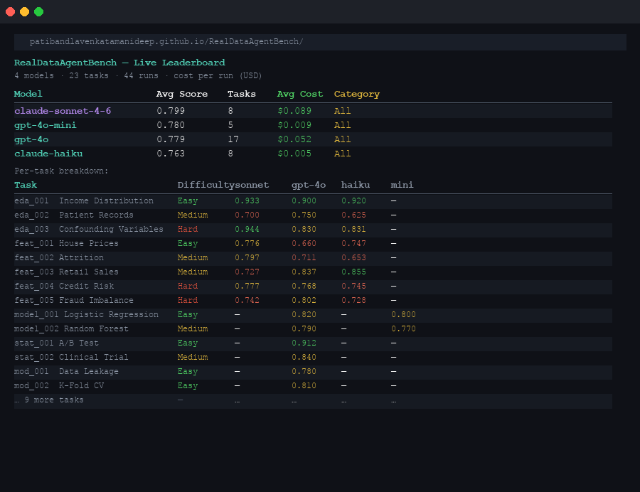

<p align="center">
  
</p>

<p align="center">
  <strong>Most LLMs get the right answer. RDAB checks if they did it the right way.</strong>
</p>

<p align="center">
  <a href="https://github.com/patibandlavenkatamanideep/RealDataAgentBench/actions"></a>
  <a href="https://github.com/patibandlavenkatamanideep/RealDataAgentBench/actions/workflows/ci.yml"></a>
  <a href="https://www.python.org/"></a>
  <a href="https://github.com/patibandlavenkatamanideep/RealDataAgentBench/blob/main/LICENSE"></a>
  <a href="https://patibandlavenkatamanideep.github.io/RealDataAgentBench/"></a>
  <a href="SCORING_SPEC.md"></a>
  <a href="tasks/"></a>
</p>

> **Frontier models score 0.84–0.99 on correctness.** Statistical validity ranges from 0.52 (feature engineering) to 0.90 (statistical inference). Models know when statistical language is expected — not when it's warranted. The gap is largest where it's least visible.

---

## TL;DR

- **12 models · 39 tasks · 4-dimensional scoring** — correctness alone misses where agents fail in production data workflows
- **gpt-4.1-mini leads at 0.872** with full 39-task multi-run CI — and is 65× cheaper than GPT-5 (0.780)
- **A free model (Llama 3.3-70b, 0.798) beats GPT-5 (0.780)** — aggregate rankings hide that free models outperform expensive frontier models on this benchmark
- **Statistical validity is the differentiating dimension:** Claude leads on validity (Sonnet 0.851), GPT leads on correctness (gpt-4.1-mini 0.937) — the two correlate at r = 0.43, confirming they capture orthogonal capabilities

---

## Leaderboard — 1,180+ runs · 12 models · 39 tasks

**→ [Open live leaderboard](https://patibandlavenkatamanideep.github.io/RealDataAgentBench/)** — filterable by category, sortable by score or cost



| Rank | Model | RDAB Score | Runs | Cost / Task | Stat Validity | Coverage |
|:----:|-------|:----------:|:----:|:-----------:|:-------------:|:--------:|
| 1 | **gpt-4.1** | **0.875** | 119 | $0.033 | 0.747 | 39/39 ✓ |
| 2 | **gpt-4.1-mini** | **0.872** | 133 | $0.010 | 0.746 | 39/39 ✓ |
| — | claude-sonnet-4-6 ⚠️ | 0.857 | 29 | $0.317 | **0.851** | 23/39 |
| 3 | gpt-4o | 0.851 | 130 | $0.053 | 0.751 | 39/39 ✓ |
| — | claude-opus-4-6 ⚠️ | 0.846 | 23 | $1.628 | 0.793 | 23/39 |
| 4 | grok-3-mini | 0.827 | 228 | $0.004 | 0.704 | 39/39 ✓ |
| — | claude-haiku-4-5 † | 0.801 | 180 | $0.040 | 0.750 | 33/39 ↑ |
| 5 | llama-3.3-70b | 0.798 | 71 | $0.002 | 0.694 | 39/39 ✓ |
| 6 | gpt-4o-mini | 0.785 | 123 | $0.012 | 0.770 | 39/39 ✓ |
| — | gpt-5 ⚠️ | 0.780 | 32 | $0.671 | 0.690 | 23/39 |
| 7 | gemini-2.5-flash | 0.662 | 206 | $0.002 | 0.538 | 39/39 ✓ |
| 8 | gpt-4.1-nano | 0.624 | 138 | $0.010 | 0.685 | 39/39 ✓ |

> ✓ = full 39-task multi-run CI &nbsp;·&nbsp; † = CI in progress &nbsp;·&nbsp; ⚠️ = single-run point estimate, no CI planned (cost-prohibitive)  
> **Ranking requires ≥80% task coverage** — see [SCORING_SPEC.md §10](SCORING_SPEC.md#10-ranking-eligibility--coverage-threshold)

---

## Key Findings

> **Insight 1 — Statistical validity is category-dependent, not uniformly weak**
>
> By category: stat inference = 0.897 · EDA = 0.849 · ML engineering = 0.740 · modeling = 0.603 · feature engineering = 0.520. Models reach for statistical language reactively when cued by the task name — not proactively when warranted. Feature engineering is worst: models report importances and coefficients without uncertainty bounds because nothing in the task name signals that statistics are expected.
>
> By model family: Claude leads on stat-validity (Sonnet 0.851, Opus 0.793, Haiku 0.750); GPT leads on correctness (gpt-4.1-mini 0.937). Correctness × stat-validity correlate at r = 0.43 — largely orthogonal capabilities. **Aggregate rank masks two independent gradients.**

---

> **Insight 2 — No single model dominates across categories**
>
> | Category | Best Model | Avg RDAB |
> |----------|-----------|:--------:|
> | EDA | gpt-4.1-mini | 0.939 |
> | Feature Engineering | gpt-4.1 | 0.846 |
> | Statistical Inference | gpt-4.1 | 0.957 |
> | ML Engineering | gpt-4.1-mini | 0.866 |
> | Modeling | claude-sonnet-4-6 ⚠️ | 0.871 |
>
> Llama 3.3-70b (free) beats GPT-5 on modeling (0.748 vs 0.692) and overall (0.798 vs 0.780). **Benchmark before you commit to a provider.**

---

> **Insight 3 — Claude models massively over-spend tokens**
>
> Claude Haiku: 608,861 tokens on `feat_005` (efficiency = 0.13). Claude Sonnet: 375,920 tokens on `feat_004`. GPT-4.1 and Llama completed the same tasks in under 30,000 tokens with higher correctness. The Anthropic models explore more — but conclude less efficiently. **Token count is a capability signal, not just a cost one.**

---

> **Insight 4 — Multi-run CI reveals gaps that single-run zeros conceal**
>
> Grok-3-mini at n=1 on 23 tasks showed correctness = 0.00 on 7 sklearn-dependent tasks. At n=5 on 39 tasks, that collapses to correctness averaging 0.50–0.89 on modeling — the bimodal shape persists, but the model retries, occasionally adapts, and occasionally gives up. **The blind spot is real but probabilistic, not deterministic.**

---

> **Insight 5 — The best model is rarely the most expensive**
>
> gpt-4.1-mini (0.872) is statistically tied with gpt-4.1 (0.875) and beats GPT-5 (0.780) at 65× lower cost ($0.010 vs $0.671 per task). At production scale, that gap determines whether agentic data workflows are economically viable.

---

## Observed Failure Patterns

**Pattern 1 — Correct number, wrong reasoning** (`feat_002`, `feat_003`, `model_001–003`):  
Every model computes the right feature importances or coefficients — then stops. No model spontaneously reports whether the ranking is stable across folds or whether the model is overfit. Correctness = 1.0, Stat Validity = 0.25.

**Pattern 2 — Token spiral without convergence** (Claude models, `feat_004`, `feat_005`, `model_003`):  
Claude Opus and Haiku loop over `get_column_stats` on every column one-by-one, re-running the same `run_code` block with minor variations. Correct intermediate outputs, 5–15× the token budget. Efficiency scores as low as 0.12.

**Pattern 3 — Namespace blind spot** (grok-3-mini, all modeling tasks):  
Grok-3-mini attempts to import sklearn inside `run_code`, hits the sandbox restriction, retries repeatedly, and occasionally gives up entirely. The model never adapts to the pre-injected namespace. 7 zero-correctness runs on tasks it could theoretically solve.

**Pattern 4 — Gemini over-truncates** (`mod_003`, `model_002`, `feat_005`):  
Gemini 2.5 Flash produces structurally correct code but truncates its final answer before reporting key metrics. Avg correctness = 0.58 despite reasonable reasoning — it reaches the right place but doesn't output a scoreable conclusion.

---

## Why RDAB is Different

Most benchmarks ask: *"Did the agent get the right answer?"* That is not enough.

| Dimension | What it catches |
|-----------|----------------|
| **Correctness** | Right skewness direction, correlation sign, missing column counts |
| **Code Quality** | Vectorized ops, descriptive names, no raw loops |
| **Efficiency** | Token and step budget vs. task complexity |
| **Stat Validity** | Uncertainty reporting, appropriate tests, no causal overreach |

**An agent can score 1.0 on correctness and 0.25 on statistical validity on the same task.** That delta is what RDAB measures — and what every other benchmark ignores.

| Feature | **RDAB** | AgentBench | DA-Code | ScienceAgentBench | HELM |
|---------|:--------:|:----------:|:-------:|:-----------------:|:----:|
| Statistical validity dimension | ✓ | ✗ | ✗ | Partial | ✗ |
| 95% CI on leaderboard | ✓ | ✗ | ✗ | ✗ | ✗ |
| Per-run cost tracking | ✓ | ✗ | ✗ | ✗ | ✗ |
| Seeded reproducible datasets | ✓ | ✓ | ✗ | ✗ | ✓ |
| Fully local (no external download) | ✓ | ✗ | ✗ | ✗ | ✗ |
| LLM-as-judge calibration | ✓ | ✗ | ✗ | ✗ | ✗ |
| Category-aware scoring | ✓ | ✗ | ✗ | Partial | Partial |
| Real-data tasks | ✓ | ✗ | ✓ | ✓ | ✗ |
| Open source harness | ✓ | ✓ | ✓ | ✗ | ✓ |

---

## Quickstart

```bash
git clone https://github.com/patibandlavenkatamanideep/RealDataAgentBench
cd RealDataAgentBench && pip install -e ".[dev]"

cp .env.example .env              # add your API key(s)

dab run eda_001 --dry-run         # validate environment (no API call)
dab run eda_001 --model gpt-4.1   # single live run

# 3 runs per task gives 95% CI estimates (~3× cost, strongly recommended)
dab run --all --model gpt-4.1 --runs 3 --temperature 0
```

```bash
dab list                          # browse all 39 tasks
dab score outputs/<file>.json     # re-score any saved trace
dab models                        # check supported models + API key status
```

Free option — no credit card required:

```bash
# Add GROQ_API_KEY to .env (console.groq.com)
dab run --all --model groq --runs 5  # llama-3.3-70b-versatile, ~$0.007 total
```

---

## Scoring

Each task is scored across four independent dimensions, then combined into a weighted **RDAB Score**:

| Dimension | What it measures | Typical weight |
|-----------|-----------------|:--------------:|
| **Correctness** | Ground truth match — skewness, correlation sign, column counts | 40–50% |
| **Code Quality** | Vectorized ops, descriptive names, no raw loops | 15–20% |
| **Efficiency** | Tokens and steps vs. per-task budget | 15% |
| **Stat Validity** | Uncertainty reporting, appropriate methods, no causal overreach | 15–30% |

Weights are defined per-task in the YAML. The full specification — every formula, regex, threshold, and known limitation — is in **[SCORING_SPEC.md](SCORING_SPEC.md)**. Every leaderboard score is independently reproducible from that document alone without reading source code.

---

## Tasks

39 tasks across 5 categories: EDA (7), Feature Engineering (8), Modeling (8), Statistical Inference (8), ML Engineering (8). 6 use real UCI/sklearn datasets; 33 use seeded synthetic generators. Difficulty spans easy (skewness, log transform) to hard (nested cross-validation, multicollinearity, Simpson's paradox).

<details>
<summary>All 39 tasks with descriptions</summary>

The 6 real-data tasks (`eda_004`, `eda_005`, `feat_006`, `model_006`, `stat_006`, `mod_006`) use publicly licensed datasets from UCI and sklearn. Ground truths are computed independently from the actual data — reproducible by running `sklearn.datasets.load_*()` directly.

### Exploratory Data Analysis (7 — 5 synthetic · 2 real)

| ID | Title | Difficulty | Key Concepts |
|----|-------|:----------:|-------------|
| eda_001 | Income Distribution Analysis | Easy | Skewness, log transform |
| eda_002 | Patient Records — Missing Data & Outlier Audit | Medium | Missing rates, IQR outliers |
| eda_003 | E-Commerce Confounding Variable Detection | Hard | Simpson's Paradox, partial correlation |
| eda_004 ⭐ | **[Real]** Breast Cancer Wisconsin — Feature Distribution & Malignancy Predictors | Medium | Real UCI data, correlation, class imbalance |
| eda_005 ⭐ | **[Real]** Iris Dataset — Species Separability & Feature Importance | Easy | Real Fisher (1936) data, linear separability |
| eda_006 | Salary Survey — Compensation Distribution & Benchmark Analysis | Easy | Skewness, log transform, department comparison |
| eda_007 | Manufacturing Quality — Process Variation & Defect Analysis | Medium | Std dev by machine, defect rate, correlation |

### Feature Engineering (8 — 7 synthetic · 1 real)

| ID | Title | Difficulty | Key Concepts |
|----|-------|:----------:|-------------|
| feat_001 | Polynomial Feature Engineering for House Prices | Easy | Interaction terms, R² comparison |
| feat_002 | Categorical Encoding & Feature Selection | Medium | One-hot encoding, RF feature importance |
| feat_003 | Datetime Feature Extraction for Retail Sales | Medium | Datetime parsing, weekend effect |
| feat_004 | Feature Selection Pipeline for Credit Risk | Hard | Multicollinearity, ROC-AUC, Gradient Boosting |
| feat_005 | Feature Engineering for Imbalanced Fraud Detection | Hard | SMOTE, F1-score, class imbalance |
| feat_006 ⭐ | **[Real]** Diabetes Dataset — Feature Correlation & Regression Baseline | Medium | Real Efron et al. (2004) data, feature ranking, R² |
| feat_009 | Employee Attrition — Categorical Encoding & Feature Importance | Medium | Label vs one-hot, ordinal encoding, RF importance |
| feat_010 | Retail Sales — Lag & Rolling Window Features for Time Series | Hard | Lag features, rolling mean, autocorrelation |

### Modeling (8 — 7 synthetic · 1 real)

| ID | Title | Difficulty | Key Concepts |
|----|-------|:----------:|-------------|
| model_001 | Logistic Regression for Diabetes Prediction | Easy | Coefficients, ROC-AUC, feature ranking |
| model_002 | Random Forest for Wine Quality | Medium | Feature importance, CV tuning, F1 |
| model_003 | Ridge vs Lasso for Student Performance | Medium | Regularization, RMSE, sparsity |
| model_004 | Gradient Boosting for Customer Churn | Hard | Confusion matrix, CV AUC, model comparison |
| model_005 | Multi-Model Regression for Energy Consumption | Hard | RMSE comparison, CV R², feature importance |
| model_006 ⭐ | **[Real]** Wine Recognition — Multi-Class Classification with Feature Analysis | Medium | Real UCI data, RF vs LR, flavanoids |
| model_009 | Wine Quality — Linear Regression vs Random Forest Comparison | Medium | RMSE, R², model comparison, numeric target |
| model_010 | House Prices — Ridge vs Lasso Regularization Comparison | Medium | Regularization, sparsity, coefficient shrinkage |

### Statistical Inference (8 — 7 synthetic · 1 real)

| ID | Title | Difficulty | Key Concepts |
|----|-------|:----------:|-------------|
| stat_001 | A/B Test — Conversion Rate Experiment | Easy | z-test, confidence intervals, lift |
| stat_002 | Clinical Trial — Drug Efficacy Test | Medium | t-test, Cohen's d, baseline balance |
| stat_003 | Salary Gap Analysis — Controlling for Confounders | Hard | OLS regression, pay gap, confounding |
| stat_004 | Time Series Decomposition — Sales Trend & Seasonality | Medium | Decomposition, trend, seasonality |
| stat_005 | Statistical Process Control — Manufacturing Defects | Hard | Cp index, drift detection, chi-squared |
| stat_006 ⭐ | **[Real]** Iris Species — One-Way ANOVA for Petal Length Separation | Medium | Real Fisher (1936) data, ANOVA, F-statistic |
| stat_009 | Salary Survey — Mann-Whitney Test for Non-Parametric Gender Comparison | Medium | Mann-Whitney U, non-parametric, null result |
| stat_010 | Employee Attrition — Chi-Squared Test for Overtime & Attrition Independence | Easy | Chi-squared, contingency table, Cramér's V |

### ML Engineering (8 — 7 synthetic · 1 real)

| ID | Title | Difficulty | Key Concepts |
|----|-------|:----------:|-------------|
| mod_001 | Data Leakage Detection in Model Selection | Easy | Target leakage, correlation, AUC drop |
| mod_002 | K-Fold Cross-Validation vs Single Hold-Out | Easy | CV variance, small dataset evaluation |
| mod_003 | Probability Calibration for Heart Disease Prediction | Medium | Brier score, Platt scaling, reliability |
| mod_004 | Ensemble Voting vs Individual Models | Medium | VotingClassifier, soft voting, F1 |
| mod_005 | Nested Cross-Validation for Unbiased Tuning | Hard | Selection bias, GridSearchCV, nested CV |
| mod_006 ⭐ | **[Real]** Breast Cancer Wisconsin — K-Fold CV vs Hold-Out on Real Clinical Data | Medium | Real UCI data, CV variance, stratification |
| mod_009 | Fraud Detection — Decision Threshold Optimization for Recall-Weighted F-Score | Medium | Threshold sweep, precision-recall, F-beta |
| mod_010 | Credit Risk — Feature Importance Stability via Bootstrap Resampling | Hard | Bootstrap, stability, confidence intervals |

</details>

---

## Pre-registered Experiment

The category-level stat-validity gap (feature engineering and modeling average 0.45–0.51 despite correctness ≥ 0.83) is RDAB's headline result. Before attributing it to a model capability gap, two alternative explanations require empirical testing:

| Variant | Prompt change | Tests |
|---------|--------------|-------|
| **V0 (baseline)** | Current production prompt | Control |
| **V1 (uncertainty)** | + explicit CI/SE/p-value instruction | Whether direct instruction closes the gap |
| **V2 (statistician)** | Persona → "statistician" + structured output rules | Whether role-framing changes output style |

**45 runs · ~$12.67 total · GPT-5, GPT-4.1, Llama 3.3-70B**

Design locked in [docs/experiments/uncertainty_uplift_design.md](docs/experiments/uncertainty_uplift_design.md), including exact prompt text and pre-committed outcome interpretations. Execution scheduled after the full multi-run CI baseline is in place.

---

## Why RDAB is Credible

- **Every score is independently reproducible.** [SCORING_SPEC.md](SCORING_SPEC.md) documents every formula, regex, threshold, and known limitation — no source code reading required.
- **Known limitations are disclosed.** The stat-validity scorer is lexical. `scripts/calibrate_stat_validity.py` measures agreement between the lexical scorer and an LLM judge (Pearson r and Cohen's κ) to quantify the gap.
- **Partial-coverage models are excluded from ranking.** Any model below 80% task coverage is flagged and unranked. Their scores are not averaged against different task sets.
- **Datasets are real where it matters.** Six tasks use publicly licensed real-world datasets (UCI Breast Cancer, Iris, Diabetes, Wine) with ground truths computed independently.
- **The key experiment is pre-registered.** Outcome interpretations committed before any runs are executed.

---

## Benchmark Methodology

**`dab run <task> --dry-run`** — Validates dataset loading and YAML parsing. No API call. Use this to verify your environment.

**`dab run <task>`** — Live mode. The agent receives a sandboxed Python environment with the seeded dataset pre-loaded and iterates until it produces a final answer or hits the step/timeout limit. Every tool call, token count, and final answer is recorded in the trace JSON. No simulation, no pre-cached responses — every leaderboard score is from a live API call.

**Datasets:** Seeded synthetic generators (33 tasks) and publicly licensed UCI/sklearn datasets (6 tasks). All generated locally at runtime. Trace outputs write to your local `outputs/` directory.

**Scoring:** The four scorers (`correctness`, `code_quality`, `efficiency`, `stat_validity`) run independently on the trace JSON. The composite RDAB Score is a weighted average using per-task weights from the task YAML.

---

## Known Limitations

**Lexical stat-validity scorer.** Detects vocabulary, not reasoning quality. A model that writes "confidence interval" without computing one still passes Check 1. Calibration script quantifies the gap.

**Seeded synthetic datasets.** 33 of 39 tasks use reproducible generators — RDAB does not test robustness to real-world data quality issues (mixed dtypes, corrupted records, inconsistent encoding). The 6 real-data tasks partially address this.

**String-match correctness.** Ground-truth matching checks for key values or phrases in the final answer. Verbose outputs may satisfy the check when terse correct outputs do not — most relevant to EDA tasks.

**Coverage policy.** Models below 80% task coverage are excluded from ranking. Currently ranked models (all 39/39): gpt-4.1, gpt-4.1-mini, gpt-4o, gpt-4o-mini, gpt-4.1-nano, grok-3-mini, llama-3.3-70b, gemini-2.5-flash. All others flagged as partial.

**No multi-turn, RAG, or long-context scenarios.** RDAB tests single-session agentic loops on structured tabular data only.

---

## Project Structure

```
realdataagentbench/
├── core/
│   ├── task.py           # Pydantic schema — validates every YAML field
│   └── registry.py       # Discovers, loads, and filters tasks
├── datasets/
│   └── generators/       # 33 seeded synthetic generators + 6 real-data loaders
├── harness/
│   ├── tools.py          # Sandboxed agent tools (run_code, get_dataframe_info, get_column_stats)
│   ├── tracer.py         # Records every step, tool call, and token count
│   ├── agent.py          # Multi-model agentic loop
│   ├── providers.py      # Unified BaseProvider — Anthropic, OpenAI, Groq, xAI, Google
│   ├── pricing.py        # Cost per 1M tokens (single source of truth)
│   └── runner.py         # Orchestrates task → dataset → agent → trace → JSON
├── scoring/
│   ├── correctness.py    # Ground truth matching with alias expansion
│   ├── code_quality.py   # Static analysis of agent-generated code
│   ├── efficiency.py     # Token and step efficiency vs. budget
│   ├── stat_validity.py  # Lexical statistical rigour signals (category-aware)
│   ├── llm_judge.py      # LLM-as-judge scorer for calibration
│   └── composite.py      # Weighted RDAB Score + ScoreCard
└── cli.py                # dab run / list / inspect / score / models
tasks/
├── eda/                  # 7 tasks
├── feature_engineering/  # 8 tasks
├── modeling/             # 8 tasks
├── statistical_inference/ # 8 tasks
└── ml_engineering/       # 8 tasks
tests/                    # 168 offline tests — no API calls required
scripts/
├── build_leaderboard.py        # outputs/ → docs/results.json (mean ± 95% CI)
├── calibrate_stat_validity.py  # Lexical scorer vs LLM judge (Cohen's κ)
└── dimension_correlations.py   # Scorer-to-scorer Pearson correlation matrix
docs/
└── index.html            # GitHub Pages leaderboard (auto-rebuilt by CI)
```

---

## Roadmap

- **Done:** Task schema and harness (168 tests), 39 tasks, 12 models with live leaderboard, per-run cost tracking, category-aware scorer, 6 real-data tasks, LLM-as-judge calibration, multi-run CI; free models + gpt-4.1 family at full 39-task CI
- **In progress:** claude-haiku 39-task CI; pre-registered uncertainty-uplift experiment; calibration κ between lexical scorer and LLM judge
- **Next:** NLP, visualization, and time-series task categories; arXiv paper

---

## How to Cite

```bibtex
@software{patibandla2026rdab,
  author    = {Patibandla, Venkata Manideep},
  title     = {{RealDataAgentBench}: An Open Benchmark for Statistical Validity
               in LLM Data Science Agents},
  year      = {2026},
  url       = {https://github.com/patibandlavenkatamanideep/RealDataAgentBench},
  note      = {39 tasks, 4-dimensional scoring, 1{,}180+ runs across 12 models.}
}
```

To reproduce the full leaderboard:

```bash
git clone https://github.com/patibandlavenkatamanideep/RealDataAgentBench
cd RealDataAgentBench && pip install -e ".[dev]"
cp .env.example .env
dab run --all --model gpt-4.1 --runs 3 --temperature 0
python scripts/build_leaderboard.py
```

All dataset generators are seeded. Running with the same model and `--temperature 0` reproduces published scores within scoring tolerance.

---

## Adding a Task / Contributing

1. Create `tasks/<category>/<task_id>.yaml` — see [TASK_SPEC.md](TASK_SPEC.md)
2. Add a seeded generator in `realdataagentbench/datasets/generators/`
3. Register it in `realdataagentbench/datasets/__init__.py`
4. Add tests in `tests/` and verify `pytest tests/ -v` passes

See [CONTRIBUTING.md](CONTRIBUTING.md) for the full guide.

**→ [Submit your model's results](RESULTS_SUBMISSION.md)** — run all 39 tasks with the unmodified harness and open a PR. Community results strengthen the benchmark for everyone.

---

## CostGuard — Companion Tool

**CostGuard** lets you upload your own CSV and run a live cost-performance analysis against any model — without writing code. RDAB uses only its own seeded and publicly licensed datasets; CostGuard is interactive and processes your data in memory.

**[Live app →](https://costguard-production-3afa.up.railway.app/)** &nbsp;·&nbsp; **[GitHub →](https://github.com/patibandlavenkatamanideep/CostGuard)**

---

## License

MIT — see [LICENSE](LICENSE).

Built by [Venkata Manideep Patibandla](https://github.com/patibandlavenkatamanideep) — focused on LLM evaluation, agent systems, and statistically robust AI workflows.
